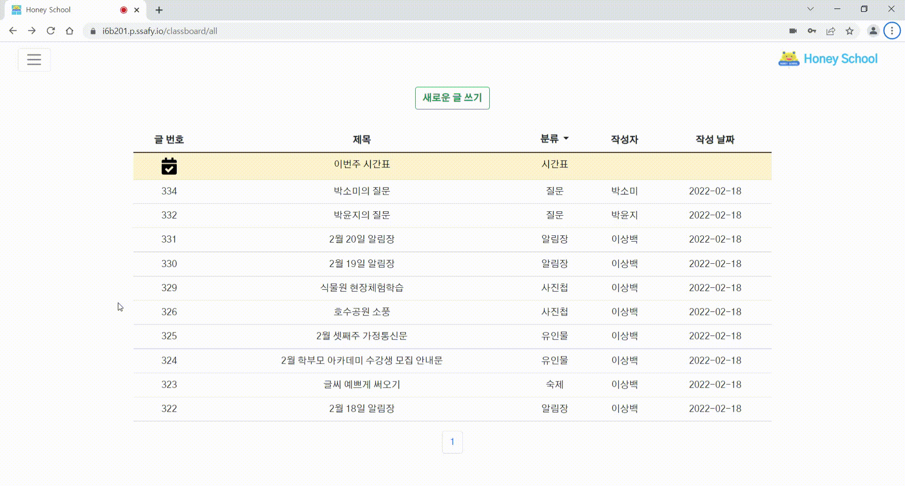
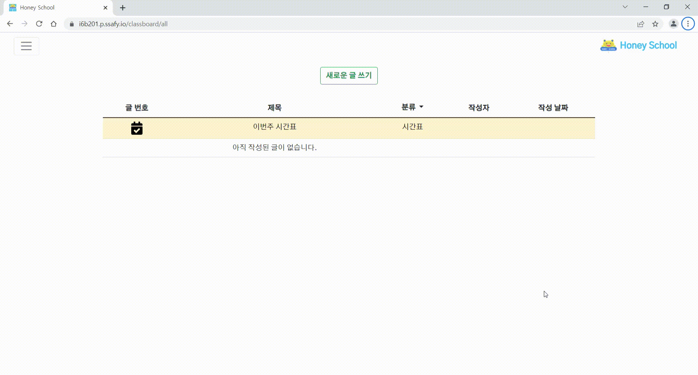
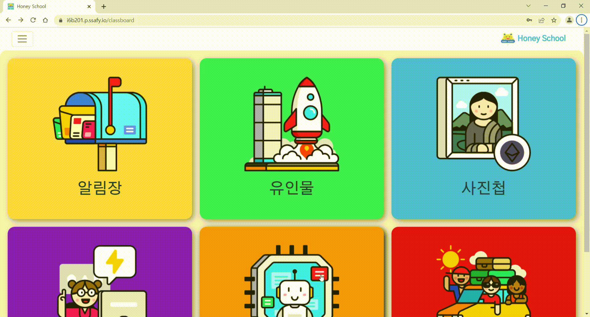
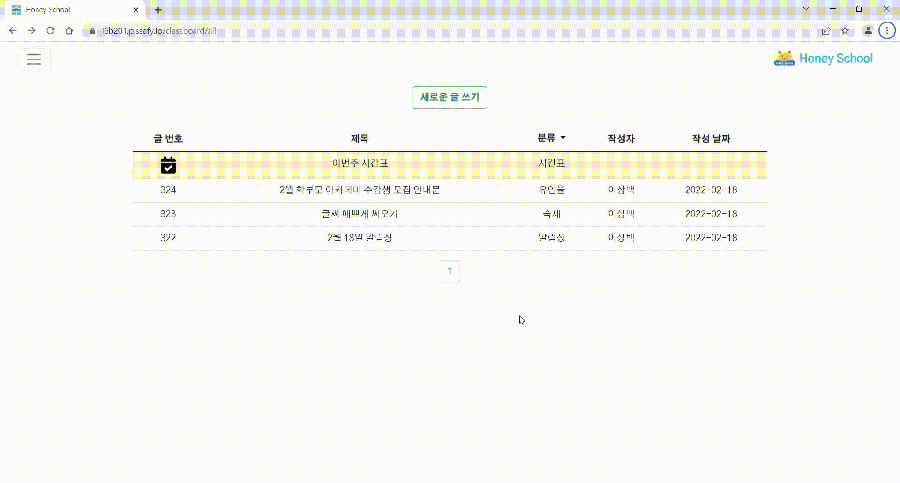

# :sparkles: 전체 서비스 화면

## 회원 관리
|                    로그인                    |                    내 정보 수정                    |
| :------------------------------------------: | :------------------------------------------------: |
|            |          |

## 화상 수업 & 시간표
|                       시간표 만들기                       |                   강의 생성 및 학생 입장                   |
| :-------------------------------------------------------: | :-------------------------------------------------------: |
|                 |       |

|                          손 들기                          |                       자리 비움 알림                      |
| :-------------------------------------------------------: | :-------------------------------------------------------: |
|               |                   |

|                         퀴즈 내기                         |                         화면 공유                         |
| :-------------------------------------------------------: | :-------------------------------------------------------: |
|                           |           |

## 숙제 게시판
|                    (선생님) 숙제 내기                     |                      (학생) 숙제 제출                      |
| :-------------------------------------------------------: | :-------------------------------------------------------: |
|                 |                 |

|                 (선생님) 숙제 피드백 하기                 |                  (학생) 숙제 피드백 확인                   |
| :-------------------------------------------------------: | :-------------------------------------------------------: |
|             |             |

## 질문 게시판
|                      (학생) 질문 하기                     |
| :-------------------------------------------------------: |
|                   |

|                 (선생님) 질문에 답변 하기                 |                   (학생) 질문 답변 확인                    |
| :-------------------------------------------------------: | :-------------------------------------------------------: |
|     | |

## 알림장 게시판

|                  (선생님) 알림장 올리기                   |                     (학생) 알림장 보기                     |
| :-------------------------------------------------------: | :-------------------------------------------------------: |
|         |             |

## 유인물 게시판

|                  (선생님) 유인물 올리기                   |                     (학생) 유인물 보기                     |
| :-------------------------------------------------------: | :-------------------------------------------------------: |
|       |           |

## 사진첩 게시판

|                  (선생님) 사진첩 올리기                   |                     (학생) 사진첩 보기                     |
| :-------------------------------------------------------: | :-------------------------------------------------------: |
|           |               |
