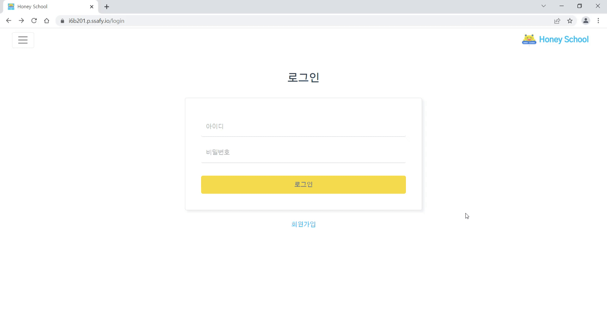
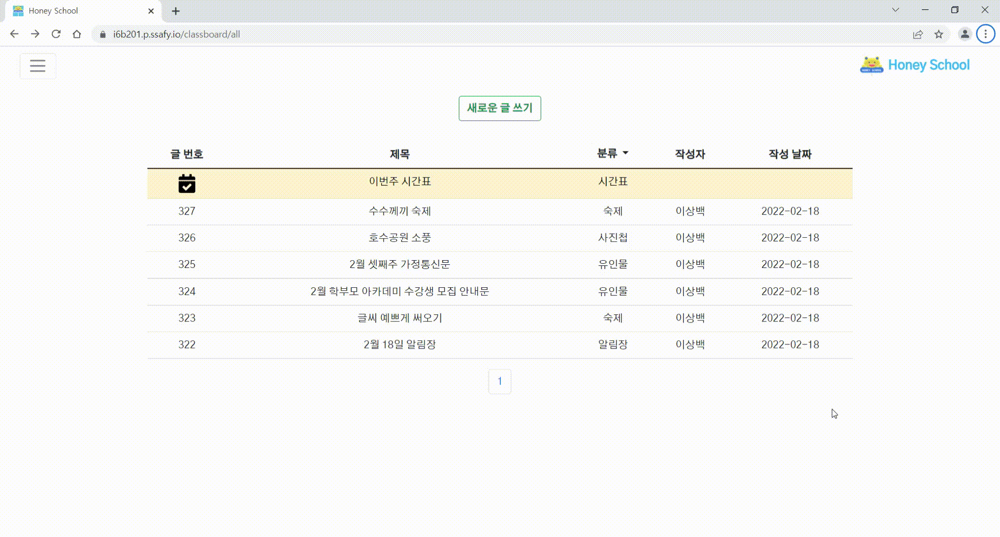
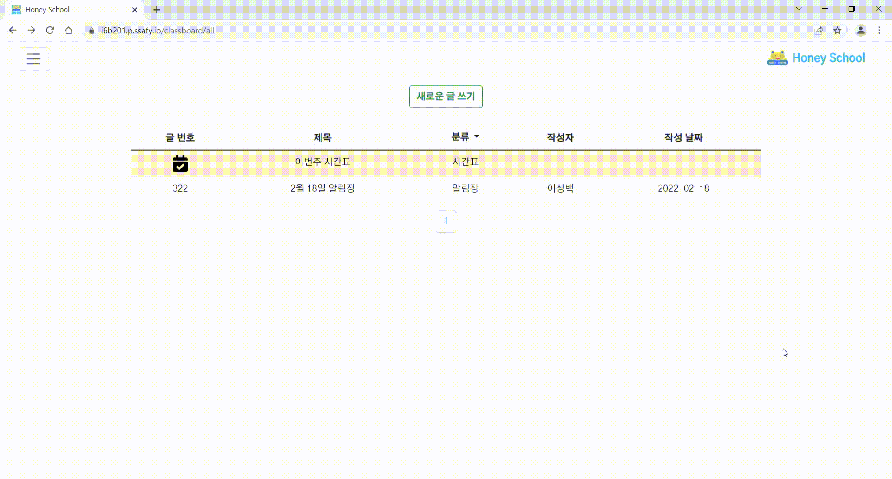
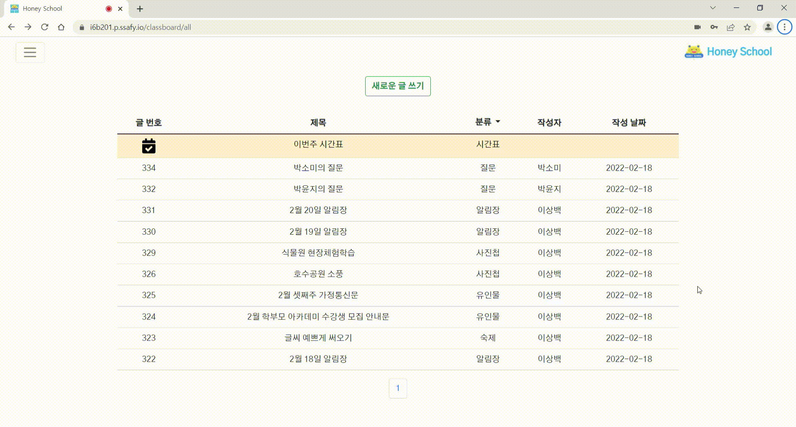

## 회원 관리
|                    로그인                    |                    내 정보 수정                    |
| :------------------------------------------: | :------------------------------------------------: |
|            |          |

## 화상 수업
|                       시간표 만들기                       |                   강의 생성 및 학생 입장                   |
| :-------------------------------------------------------: | :-------------------------------------------------------: |
|                 |       |

|                          손 들기                          |                       자리 비움 알림                      |
| :-------------------------------------------------------: | :-------------------------------------------------------: |
|               |                   |

|                         퀴즈 내기                         |                         화면 공유                         |
| :-------------------------------------------------------: | :-------------------------------------------------------: |
|                     |               |

## 숙제 게시판
|                    (선생님) 숙제 내기                     |                      (학생) 숙제 제출                      |
| :-------------------------------------------------------: | :-------------------------------------------------------: |
|                |                  |

|                 (선생님) 숙제 피드백 하기                 |                  (학생) 숙제 피드백 확인                   |
| :-------------------------------------------------------: | :-------------------------------------------------------: |
|              |                |

## 질문 게시판
|                 (선생님) 숙제 피드백 하기                 |
| :-------------------------------------------------------: |
|              |