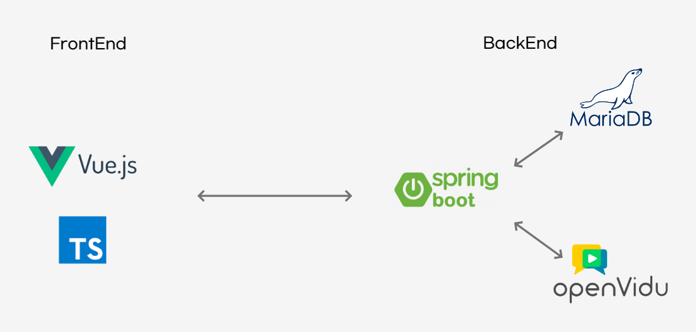

# Honey School (꿀잼스쿨)

## :hatched_chick: 초등학생과 교사를 위한 화상 교육 플랫폼

> 계속되는 비대면 수업에 지친 **선생님**,<br>
  매일 엄마에게 끌려와 수업듣는게 질린 **초등학생**,<br>
  이제는 초등 맞춤형 교육 플랫폼 **꿀잼스쿨**이 해결하겠습니다.


기존 비대면 수업 서비스에 적응하기 힘들었던 초등학생들을 위해 준비했습니다.

꿀잼스쿨을 사용하여 직접 손으로 숙제하고, 음성을 녹음해서 선생님께 질문해보세요.

더 쉽고 재미있는 공부 환경, 꿀잼스쿨이 제공해드립니다!

<br>

## :fireworks: 서비스 특징
- 초등학생의 눈높이에 맞추어 마우스, 키보드 사용을 최소화
- 화상 수업 시 집중력을 높일 수 있는 기능 제공
- 아기자기하고 직관적인 UI/UX

<br>

## :runner: 팀원 소개

|            박윤지             |                권영현                 |               박소미                |              이상백               |             정희연              |
| :---------------------------: | :-----------------------------------: | :---------------------------------: | :-------------------------------: | :-----------------------------: |
|  |  |  |  |  |
|     **Leader & Backend**     |              **Backend & CI/CD**              |             **Frontend**             |        **Frontend**        |          **Backend**           |
|     학급 게시판     |              배포, 화상 수업              |             학급 게시판, 화상 수업             |        회원 관리, 화상 수업        |          회원 관리           |

<br>

## :computer: 개발 환경

### :last_quarter_moon: Front-end

   - Vue3
   - Vuex4
   - Typescript
   - Bootstrap

### :first_quarter_moon: Back-end

   - Spring Boot
   - Spring Boot JPA
   - Spring Security
   - Java 11
   - OpenVidu
   - Lombok

### :floppy_disk: DB

   - MariaDB

### :tv: 기타 기술

   - WebRTC(OpenVidu)
   - AWS
   - Docker

<br>

## :earth_asia: 아키텍처


<br>

## 구동 메뉴얼

## FrontEnd 설정

1. 소스 다운 받기

```bash
git clone -b develop https://lab.ssafy.com/s06-webmobile1-sub2/S06P12B201.git
# 현재 /home/ubuntu/honeyschool 폴더에 받았다고 가정하고 진행
# 받으면 S06P12B201 폴더 생성 됨
```

2. 이동하기

```bash
# 이동
cd /var/www/html
# 기존의 dist 폴더 지워주기
rm -rf dist
# 새로 dist 폴더 바꿔주기
cp -r /home/ubuntu/honeyschool/S06P12B201/frontend/dist .
```

3. 도메인 접속해서 작동 유무 확인

## BackEnd 설정

1. 6단계에서 소스 다운 받았다고 가정 및 Openvidu 설치 시 사용한 p12키를 사용하여 SSL 구동합니다.

```bash
# 백엔드 소스 안에 진입 & 현재 
cd /home/ubuntu/honeyschool/S06P12B201/Backend/src/main/resources
# Openvidu 에서 사용한 키 복사
cp /home/ubuntu/opt/openvidu/certificates/live/i6b201.p.ssafy.io.p12 .
# application.properties 수정
nano application.properties

# SSL 인증 부분 수정
server.ssl.key-store=classpath:i6b201.p.ssafy.io.p12 # classpath:{키이름} classpath: src/main/resouces의 경로를 나타낸다. 
server.ssl.key-store-type=PKCS12
server.ssl.key-store-password=ssafy  # p12 키 생성하면서 사용한 비밀번호
```

2. 빌드하기

```bash
# 백엔드 프로젝트 최상위 폴더로 이동
cd /home/ubuntu/honeyschool/S06P12B201/Backend
# 권한 부여하기
chmod 700 gradlew
# build 하기
./gradlew clean build # 성공시 build 생성
# jar 파일 생성확인
cd /build/libs
ls
# Backend-0.0.1-SNAPSHOT.jar 파일 생성확인

# 구동확인
java -jar Backend-0.0.1-SNAPSHOT.jar
# 에러 없으면 build 성공
```

3. DockerFile 만들기

```bash
nano Dockerfile  # f 소문자로 해야합니다!

#아래 내용 작성
FROM openjdk:11
ARG JAR_FILE=./Backend-0.0.1-SNAPSHOT.jar
copy ${JAR_FILE} honeyschool.jar
ENTRYPOINT ["java", "-jar", "honeyschool.jar"]
EXPOSE 9999

# 설명
## FROM 명령어 -> 스프링 부트 애플레케이션이 돌아갈 베이스 이미지를 의미합니다. 베이스 이미지는 docker hub 사이트 참조
## ARG 환경변수를 만들어 준다. -> jar 파일의 위치를 정해줌
## COPY jar 파일을 honeyschool.jar이라는 이름으로 복사
## ENTRYPOINT 애플리케이션을 실행시킬 명령어
## EXPOSE 애플리케이션이 사용하는 포트 
```

3. Docker Image 만들기

```bash
docker build -t yunghun97/test .

```

4. Docker 컨테이너 기본 실행 시 (컨테이너 삭제 시 데이터 날라감)

```bash
docker run --name {원하는 컨테이너 이름} -d -p 9999:9999 {이미지 이름}

## -d 는 백그라운드에서 작동
## -p IN:OUT IN으로 들어오는 포트를 OUT 포트로 매핑해준다.
```

---

4. 도커 Volume 생성 및 마운트 하기
5. 불륨 생성하기

```bash
docker volume create {volume 명}

# docker volume create files
```

2. 불륨 생성확인

```bash
docker volume ls

```

결과  
  

3. 불륨 정보 확인

```bash
docker volume inspect {files}
```

결과  
  

4. 불륨 마운트

```bash
docker run -v {불륨이름}:{마운트할 컨테이너 내부 경로} --name {컨테이너이름} -d -p 9999:9999 {이미지이름}

# docker run -v files:/home/ubuntu/honeyschool/file --name honeyschool_be -d -p 9999:9999 yunghun97/v0.9
```

5. 마운트 적용 확인

```bash
docker inspect {컨테이너 이름}

#docker inspect honeyschool_be
```

결과  
  

6. 불륨 동기화 되었는지 확인하기

```bash
docker volume inspect files
#생략
"Mountpoint": "/var/lib/docker/volumes/{불륨명}/_data",
#생략

# 해당 폴더로 이동
cd /var/lib/docker/volumes/files/_data
# 파일 확인
ls
```


### 출처

- UI/UX 디자인 일러스트 출처
  - https://www.streamlinehq.com
  - https://emojiterra.com/

